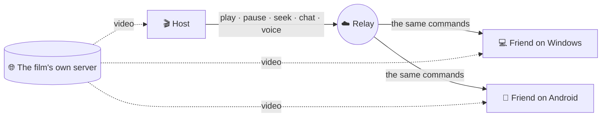
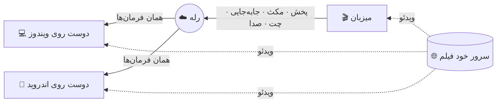

  

 

&nbsp;

  

**[English](#english)** &nbsp;·&nbsp; **[فارسی](#persian)**

---

## English

**Us Player** lets you and your friends watch the same film at the same moment, wherever you are. One person hosts a room **by name**, everyone else joins with that name — no IP addresses, no port forwarding, no router settings. Press pause and the whole room pauses. Talk over the film, send a ❤️ across the screen, read the chat without looking away.

> A PC and a phone can share a room: the [Android edition](https://github.com/Pytholearn/UsPlayer-Android) speaks exactly the same protocol.

### ✨ Features

<table>
<tr>
<td width="50%" valign="top">

#### 🎬 Watch party
- Host or join **by room name** — one click, nothing to configure
- **Shared control**: anyone's play, pause, seek or speed change reaches everyone
- Stays within **about ±100 ms** — clock sync, gentle rate nudging, seeks only when needed
- Optional room **password** that never crosses the wire
- Host tools: kick, mute someone's chat
- A subtitle the host loads **travels with the room**, late joiners included

</td>
<td width="50%" valign="top">

#### 🎙️ Together
- **Voice chat** — push-to-talk or open mic with a noise gate, per-person mute
- **Chat over the picture**: every line fades along the bottom of the video
- **Floating reactions** 👍 ❤️ 😂 😮 🔥 👏
- Who is here, their ping, their connection quality, who is speaking
- Typing indicator and unread badge

</td>
</tr>
<tr>
<td valign="top">

#### 🔗 Smart links
- Paste a **movie page**, not just a direct link — Us Player finds the real `.mp4` / `.mkv` / `.m3u8` behind it and shows every step
- Picks the main film's best quality and skips trailers and sidebars
- A Search tab lists sites to find a film on
- Broken links with doubled query strings are repaired automatically

</td>
<td valign="top">

#### 🎛️ Player
- 0.25–4× speed, frame stepping, chapters, screenshots
- **Mini player** (always on top), fullscreen with auto-hiding controls
- Resume where you left off, history, favorites
- Auto-reconnect when a stream stalls, network diagnostics
- Subtitles: delay, size, color, outline, font, **encoding picker** for Persian `.srt`

</td>
</tr>
<tr>
<td valign="top">

#### 🔊 Audio & video
- Volume up to **300%** with an optional compressor
- **10-band equalizer** with presets, normalization
- Brightness, contrast, saturation, gamma, hue — live
- Aspect, crop, zoom, rotate, mirror, sharpen, deinterlace

</td>
<td valign="top">

#### 💙 Made for people
- **Persian and English**, right-to-left done properly
- Three themes — **Us Blue**, Dark Purple, Dark Mint
- A guided tour on first launch, in both languages
- **Updates itself**, and checks every download's SHA-256 first
- Portable: settings and history live next to the app. **No telemetry.**

</td>
</tr>
</table>

### 📥 Install

1. Download **`UsPlayer-Setup-<version>.exe`** from the [latest release](https://github.com/Pytholearn/UsPlayer/releases/latest).
2. Run it. It installs the app, adds shortcuts, and creates an uninstaller.
3. Windows may say **"Windows protected your PC — unknown publisher"**. That is normal for an app that is not code-signed yet: click **More info → Run anyway**. The SHA-256 of every file is on its release page.

Prefer no installer? Take **`UsPlayer-win64.zip`**, unzip it anywhere, run `UsPlayer.exe`.

### 🍿 Watch together in three steps

| | Host | Friends |
|:-:|---|---|
| **1** | **Party → Host**, type a room name (and a password if you like) | **Party → Join**, type the same name |
| **2** | Press **Create Room** | Press **Join** |
| **3** | Open a film by link | It opens for them too, in sync |

### 🧠 How it works

The film **never goes through our server**. Every person streams it straight from where it lives; only tiny control messages — play, pause, seek, chat — and voice pass through the relay.

### 🔒 Privacy & security

- **Room passwords never leave your computer.** Joining is a salted challenge and response; only a proof crosses the network.
- **Everything that arrives from a room is treated as hostile.** Every message is size-capped and validated, replays are rejected, floods are rate-limited.
- **A file on your PC is never broadcast.** A path means nothing on someone else's machine — or worse, means a different film — so the room pauses and asks for a link instead.
- **Updates are verified.** A download that does not match the SHA-256 published beside it is thrown away.
- **No telemetry.** Nothing about what you watch is sent anywhere.

### ❓ FAQ

<b>Do my friends need to be on the same network, or open a port?</b>

 
No. Rooms are claimed by name on the relay, so friends anywhere can join with nothing but that name.

<b>Can someone on a phone join my room?</b>

 
Yes. <a href="https://github.com/Pytholearn/UsPlayer-Android">Us Player for Android</a> joins and hosts the same rooms, with chat, reactions and voice.

<b>My Persian subtitle shows <code>???</code> or broken letters.</b>

 
Open the subtitle settings and set the <b>encoding</b> to <b>Windows-1256</b>. That is how most Persian <code>.srt</code> files are saved.

<b>Can I share a film that is on my PC?</b>

 
Not by path — it would mean nothing on a friend's machine. Share a link everyone can open instead; the room pauses and tells you so if you try.

<b>A site says the film cannot be played.</b>

 
Subscription services with DRM (Filimo, Namava, Gapfilm) cannot be played outside their own apps, and Us Player says so rather than failing silently. For Iranian sites, turning your VPN off often helps — their servers block foreign connections.

---

## فارسی

**Us Player** به تو و دوستانت اجازه می‌دهد یک فیلم را در یک لحظه با هم ببینید، هر جا که هستید. یک نفر با یک **اسم** اتاق می‌سازد و بقیه با همان اسم وارد می‌شوند — بدون IP، بدون پورت‌فورواردینگ، بدون دست زدن به مودم. یکی مکث بزند، کل اتاق مکث می‌کند. روی فیلم با هم حرف بزنید، یک ❤️ روی صفحه بفرستید، چت را بخوانید بی‌آنکه چشم از فیلم بردارید.

> کامپیوتر و گوشی می‌توانند در یک اتاق باشند: [نسخهٔ اندروید](https://github.com/Pytholearn/UsPlayer-Android) دقیقاً همین پروتکل را حرف می‌زند.

### ✨ امکانات

<table dir="rtl">
<tr>
<td width="50%" valign="top">

#### 🎬 تماشای گروهی
- ساختن و پیوستن **با اسم اتاق** — یک کلیک، بدون تنظیمات
- **کنترل مشترک**: پخش، مکث، جلو و عقب یا تغییر سرعت هر کسی به همه می‌رسد
- اختلاف **حدود ±۱۰۰ میلی‌ثانیه** — همگام‌سازی ساعت، تنظیم نرم سرعت، و پرش فقط وقتی لازم است
- **رمز** اختیاری برای اتاق که هیچ‌وقت روی شبکه نمی‌رود
- ابزار میزبان: بیرون کردن، بستن چت یک نفر
- زیرنویسی که میزبان باز می‌کند **برای همه ارسال می‌شود**، حتی کسی که دیر می‌رسد

</td>
<td width="50%" valign="top">

#### 🎙️ با هم
- **چت صوتی** — دکمهٔ نگه‌داشتنی یا میکروفون باز با فیلتر نویز، بی‌صدا کردن هر نفر
- **چت روی تصویر**: هر پیام کم‌رنگ پایین فیلم می‌آید
- **واکنش‌های شناور** 👍 ❤️ 😂 😮 🔥 👏
- چه کسی حاضر است، پینگ و کیفیت اتصالش، چه کسی حرف می‌زند
- نشانگر «در حال نوشتن» و شمارندهٔ پیام‌های خوانده‌نشده

</td>
</tr>
<tr>
<td valign="top">

#### 🔗 لینک هوشمند
- **لینک صفحهٔ فیلم** را بچسبان، نه فقط لینک مستقیم — Us Player خودش فایل واقعی `.mp4` / `.mkv` / `.m3u8` را پیدا می‌کند و تک‌تک مراحل را نشان می‌دهد
- بهترین کیفیت فیلم اصلی را انتخاب می‌کند و از تریلر و فیلم‌های کناری می‌گذرد
- تب جستجو سایت‌هایی برای پیدا کردن فیلم را فهرست کرده
- لینک‌های خراب با پارامترهای تکراری خودکار تعمیر می‌شوند

</td>
<td valign="top">

#### 🎛️ پخش‌کننده
- سرعت ۰٫۲۵ تا ۴ برابر، فریم‌به‌فریم، فصل‌ها، اسکرین‌شات
- **پخش‌کنندهٔ کوچک** (همیشه رو)، تمام‌صفحه با کنترل‌های خودپنهان‌شو
- ادامه از همان‌جا، تاریخچه، علاقه‌مندی‌ها
- اتصال دوباره هنگام قطعی، عیب‌یابی شبکه
- زیرنویس: تأخیر، اندازه، رنگ، حاشیه، فونت، و **انتخاب انکودینگ** برای `.srt` فارسی

</td>
</tr>
<tr>
<td valign="top">

#### 🔊 صدا و تصویر
- بلندی صدا تا **۳۰۰٪** با کمپرسور اختیاری
- **اکولایزر ۱۰ باند** با پیش‌تنظیم‌ها، یکنواخت‌سازی صدا
- روشنایی، کنتراست، اشباع، گاما، رنگ — زنده
- نسبت تصویر، برش، بزرگ‌نمایی، چرخش، آینه، شارپ، دی‌اینترلیس

</td>
<td valign="top">

#### 💙 برای آدم‌ها ساخته شده
- **فارسی و انگلیسی**، با راست‌به‌چپ درست و حسابی
- سه تم — **Us Blue**، بنفش تیره، نعنایی تیره
- معرفی قدم‌به‌قدم در اولین اجرا، به هر دو زبان
- **خودش را آپدیت می‌کند** و قبلش SHA-256 هر دانلود را بررسی می‌کند
- قابل‌حمل: تنظیمات و تاریخچه کنار خود برنامه. **بدون هیچ ردیابی.**

</td>
</tr>
</table>

### 📥 نصب

1. فایل **`UsPlayer-Setup-<نسخه>.exe`** را از [آخرین ریلیز](https://github.com/Pytholearn/UsPlayer/releases/latest) دانلود کن.
2. اجرایش کن. برنامه نصب می‌شود، میانبر می‌سازد و حذف‌کننده هم اضافه می‌کند.
3. ممکن است ویندوز بگوید **«Windows protected your PC — unknown publisher»**. برای برنامه‌ای که هنوز امضای دیجیتال ندارد طبیعی است: **More info ← Run anyway** را بزن. SHA-256 هر فایل در صفحهٔ ریلیز آمده.

نصب نمی‌خواهی؟ **`UsPlayer-win64.zip`** را بگیر، هر جا خواستی باز کن و `UsPlayer.exe` را اجرا کن.

### 🍿 تماشای گروهی در سه قدم

| | میزبان | دوستان |
|:-:|---|---|
| **۱** | **Party ← Host**، یک اسم اتاق (و اگر خواستی رمز) | **Party ← Join**، همان اسم |
| **۲** | **Create Room** را بزن | **Join** را بزن |
| **۳** | یک فیلم را با لینک باز کن | برای آن‌ها هم باز می‌شود، هماهنگ |

### 🧠 چطور کار می‌کند

فیلم **هیچ‌وقت از سرور ما رد نمی‌شود**. هر کس فیلم را مستقیم از جای خودش پخش می‌کند؛ فقط پیام‌های کوچک کنترلی — پخش، مکث، جابه‌جایی، چت — و صدای گفتگو از رله می‌گذرند.

### 🔒 حریم خصوصی و امنیت

- **رمز اتاق هیچ‌وقت از کامپیوترت بیرون نمی‌رود.** ورود با چالش و پاسخ نمک‌دار است؛ فقط یک اثبات روی شبکه می‌رود.
- **هر چه از اتاق برسد نامطمئن فرض می‌شود.** اندازهٔ هر پیام محدود و بررسی می‌شود، پیام‌های تکراری رد می‌شوند و سیل پیام مهار می‌شود.
- **فایل روی کامپیوترت هیچ‌وقت پخش نمی‌شود.** یک مسیر روی کامپیوتر کس دیگری معنایی ندارد — یا بدتر، به فیلم دیگری اشاره می‌کند — پس اتاق مکث می‌کند و لینک می‌خواهد.
- **آپدیت‌ها بررسی می‌شوند.** دانلودی که با SHA-256 منتشرشده‌اش نخواند دور ریخته می‌شود.
- **بدون ردیابی.** هیچ چیزی دربارهٔ آنچه می‌بینی جایی فرستاده نمی‌شود.

### ❓ سؤال‌های رایج

<b>دوستانم باید در یک شبکه باشند یا پورت باز کنند؟</b>

 
نه. اتاق‌ها با اسم روی رله گرفته می‌شوند، پس دوستانت از هر جا فقط با همان اسم وارد می‌شوند.

<b>کسی با گوشی می‌تواند وارد اتاقم شود؟</b>

 
بله. <a href="https://github.com/Pytholearn/UsPlayer-Android">Us Player اندروید</a> همین اتاق‌ها را می‌سازد و به آن‌ها وارد می‌شود، با چت، واکنش و صدا.

<b>زیرنویس فارسی‌ام <code>???</code> یا حروف به‌هم‌ریخته نشان می‌دهد.</b>

 
تنظیمات زیرنویس را باز کن و <b>انکودینگ</b> را روی <b>Windows-1256</b> بگذار. بیشتر فایل‌های <code>.srt</code> فارسی این‌طور ذخیره شده‌اند.

<b>می‌توانم فیلمی که روی کامپیوترم است را به اشتراک بگذارم؟</b>

 
نه با مسیر فایل — روی کامپیوتر دوستت معنایی ندارد. لینکی بگذار که همه بتوانند باز کنند؛ اگر امتحان کنی، اتاق مکث می‌کند و همین را می‌گوید.

<b>یک سایت می‌گوید فیلم قابل پخش نیست.</b>

 
سرویس‌های اشتراکی با DRM (فیلیمو، نماوا، گپ‌فیلم) بیرون از اپ خودشان پخش نمی‌شوند و Us Player این را صریح می‌گوید، نه اینکه بی‌صدا شکست بخورد. برای سایت‌های ایرانی خاموش کردن VPN معمولاً کمک می‌کند — سرورهایشان اتصال خارجی را می‌بندند.

---

**Us Player** · Created by **Hazard** · [usplayer.ir](https://usplayer.ir)

[Windows](https://github.com/Pytholearn/UsPlayer) · [Android](https://github.com/Pytholearn/UsPlayer-Android) · [MIT License](LICENSE)

If Us Player made a movie night better, a ⭐ helps other people find it. اگر Us Player یک شب فیلم را بهتر کرد، یک ⭐ کمک می‌کند بقیه هم پیدایش کنند.

