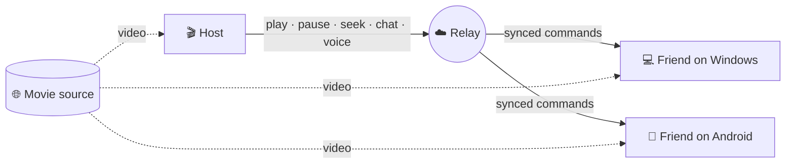

 

**Watch the same movie at the same time — with friends, anywhere.**

 

<!--
--><!--
--><!--
-->

 

| | |
| :--: | :--: |
| **Windows** | **Android** |
|  |  |
| <code>UsPlayer-Setup.exe</code> · portable <code>UsPlayer-win64.zip</code> | Same rooms — chat, reactions &amp; voice |
| <a href="#install">Install guide</a> · SHA-256 on releases | <a href="https://github.com/Pytholearn/UsPlayer-Android">UsPlayer-Android</a> |

 

**Read in your language** (English is the default)

<!--
--><!--
--><!--
-->

---

**Us Player** is a watch-party player for Windows. Host a room with a **name**, invite friends with that same name, and everyone stays in sync — no IP addresses, port forwarding, or router tweaks. When someone pauses, the room pauses. Chat over the video, react with ❤️, and keep your eyes on the movie.

> **Windows + Android:** Friends on phones can join the same room. The [Android app](https://github.com/Pytholearn/UsPlayer-Android) uses the same protocol as the desktop player.

**On this page:** [Features](#features) · [Install](#install) · [Watch together](#watch-together) · [How it works](#how-it-works) · [Privacy](#privacy) · [FAQ](#faq) · [License](#license)

## ✨ **Features**

**Watch together** · **Find any link** · **Pro-grade playback** · **Private by design**

 

| **Together** | **Player** | **Quality of life** |
| :--: | :--: | :--: |
| Synced rooms | Smart URLs | EN + FA UI |
| Voice & chat | 4× speed & EQ | No telemetry |
| ±100 ms sync | Subtitles & mini player | Auto-updates |

 

<table width="100%">
<thead>
<tr>
<th align="left" width="50%"><strong>🎬 Watch party</strong></th>
<th align="left" width="50%"><strong>🎙️ Stay connected</strong></th>
</tr>
</thead>
<tbody>
<tr>
<td valign="top">

<ul>
<li><strong>Join by room name</strong> — Host or enter in one click; no IPs or port forwarding.</li>
<li><strong>Shared playback</strong> — Play, pause, seek, and speed stay in sync for everyone.</li>
<li><strong>±100 ms sync</strong> — Clock alignment and gentle rate correction; seek when needed.</li>
<li><strong>Room password</strong> — Optional; verified locally, never sent in plain text.</li>
<li><strong>Host tools</strong> — Remove a guest or mute someone’s chat.</li>
<li><strong>Shared subtitles</strong> — What the host opens is sent to the room, including late joiners.</li>
</ul>

</td>
<td valign="top">

<ul>
<li><strong>Voice chat</strong> — Push-to-talk or always-on mic with a noise gate; per-person mute.</li>
<li><strong>On-screen chat</strong> — Messages fade in along the bottom of the video.</li>
<li><strong>Live reactions</strong> — 👍 ❤️ 😂 😮 🔥 👏 across the screen.</li>
<li><strong>Room roster</strong> — Who’s here, ping, connection quality, and who’s speaking.</li>
<li><strong>Chat polish</strong> — Typing indicators and unread counts.</li>
</ul>

</td>
</tr>
</tbody>
</table>

 

<table width="100%">
<thead>
<tr>
<th align="left" width="50%"><strong>🔗 Smart links</strong></th>
<th align="left" width="50%"><strong>🎛️ Player</strong></th>
</tr>
</thead>
<tbody>
<tr>
<td valign="top">

<ul>
<li><strong>Page URLs</strong> — Paste a movie page; Us Player finds <code>.mp4</code>, <code>.mkv</code>, or <code>.m3u8</code> and shows each step.</li>
<li><strong>Best stream</strong> — Picks the main movie at the highest quality; skips trailers and clutter.</li>
<li><strong>Search tab</strong> — Curated sites to find what you want to watch.</li>
<li><strong>Link repair</strong> — Fixes broken URLs, including duplicated query strings.</li>
</ul>

</td>
<td valign="top">

<ul>
<li><strong>Speed & frames</strong> — 0.25×–4× playback, frame step, chapters, screenshots.</li>
<li><strong>Layouts</strong> — Mini player (always on top) and fullscreen with auto-hiding controls.</li>
<li><strong>Your library</strong> — Resume, history, and favorites.</li>
<li><strong>Reliability</strong> — Auto-reconnect when a stream stalls; network diagnostics.</li>
<li><strong>Subtitles</strong> — Delay, size, color, outline, font, plus <strong>encoding</strong> for Persian <code>.srt</code> files.</li>
</ul>

</td>
</tr>
</tbody>
</table>

 

<table width="100%">
<thead>
<tr>
<th align="left" width="50%"><strong>🔊 Audio & video</strong></th>
<th align="left" width="50%"><strong>💙 Built with care</strong></th>
</tr>
</thead>
<tbody>
<tr>
<td valign="top">

<ul>
<li><strong>Loud & clear</strong> — Volume up to <strong>300%</strong> with an optional compressor.</li>
<li><strong>10-band EQ</strong> — Presets and normalization.</li>
<li><strong>Picture controls</strong> — Brightness, contrast, saturation, gamma, and hue — live.</li>
<li><strong>Transform</strong> — Aspect, crop, zoom, rotate, mirror, sharpen, deinterlace.</li>
</ul>

</td>
<td valign="top">

<ul>
<li><strong>English & Persian</strong> — Full UI with proper right-to-left layout.</li>
<li><strong>Themes</strong> — <strong>Us Blue</strong>, Dark Purple, and Dark Mint.</li>
<li><strong>First-run tour</strong> — Guided intro in both UI languages.</li>
<li><strong>Safe updates</strong> — Automatic updates with <strong>SHA-256</strong> verification.</li>
<li><strong>Portable</strong> — Settings and history live next to the app · <strong>No telemetry</strong>.</li>
</ul>

</td>
</tr>
</tbody>
</table>

### 📥 Install

1. Download **`UsPlayer-Setup-<version>.exe`** from the [latest release](https://github.com/Pytholearn/UsPlayer/releases/latest).
2. Run the installer — it adds Start Menu shortcuts and an uninstall entry.
3. If Windows shows **“Windows protected your PC — unknown publisher”**, that’s expected until the app is code-signed. Choose **More info → Run anyway**. Every release lists **SHA-256** hashes so you can verify downloads.

**Prefer portable?** Grab **`UsPlayer-win64.zip`**, extract it anywhere, and run **`UsPlayer.exe`** — no installer required.

### 🍿 Start a watch party in three steps

| Step | Host | Friends |
|:-:|---|---|
| **1** | Open **Party → Host**, pick a room name (optional password) | Open **Party → Join**, enter the same name |
| **2** | Click **Create Room** | Click **Join** |
| **3** | Open a movie from a link | The same movie opens for everyone, in sync |

### 🧠 How it works

Your movie **never passes through our servers**. Each person streams video **directly from the source**. Only small control messages — play, pause, seek, chat — plus voice audio go through the relay.

### 🔒 Privacy & security

- **Room passwords stay on your PC.** Join uses a salted challenge–response; only a proof is sent over the network.
- **Untrusted-by-default messaging.** Room traffic is size-limited, validated, protected against replay, and rate-limited.
- **Local file paths are not shared.** A path on your machine may not exist — or may point elsewhere — on a friend’s PC, so the room pauses and asks for a **link everyone can use**.
- **Verified updates.** Downloads that don’t match the published **SHA-256** are rejected.
- **No telemetry.** We don’t collect or send data about what you watch.

### ❓ FAQ

<b>Do friends need the same Wi‑Fi or an open port?</b>

 
No. Rooms are registered by name on the relay, so anyone can join from anywhere using just the room name.

<b>Can phone users join my room?</b>

 
Yes. <a href="https://github.com/Pytholearn/UsPlayer-Android">Us Player for Android</a> can host and join the same rooms, with chat, reactions, and voice.

<b>Persian subtitles show <code>???</code> or garbled text.</b>

 
Open subtitle settings and set <b>encoding</b> to <b>Windows-1256</b> — most Persian <code>.srt</code> files use that encoding.

<b>Can I share a movie stored on my PC?</b>

 
Not via a local file path — paths don’t work on other people’s machines. Use a **link** that everyone can open. If you try a local path, the room will pause and prompt you to share a link instead.

<b>A website says the movie can’t be played.</b>

 
DRM-protected services (Filimo, Namava, Gapfilm, and similar) only play inside their official apps; Us Player will tell you clearly instead of failing silently. For some Iranian sites, **turning off your VPN** helps — their servers often block overseas IPs.

### 📄 License

Us Player is open source under the **[MIT License](LICENSE)**.

| | |
|---|---|
| **Copyright** | © 2026 [Pytholearn](https://github.com/Pytholearn) |
| **You can** | Use commercially, modify, distribute, and use privately |
| **Please** | Keep the copyright and license notice in copies |
| **Note** | Software is provided *as is*, without warranty |

See the full license text in [LICENSE](LICENSE).

---

**Us Player** · Created by **Hazard** · [usplayer.ir](https://usplayer.ir)

[Windows](https://github.com/Pytholearn/UsPlayer) · [Android](https://github.com/Pytholearn/UsPlayer-Android) · [MIT License](LICENSE)

[English](README.md) · [中文](docs/README.zh-CN.md) · [فارسی](docs/README.fa.md) · [Русский](docs/README.ru.md)

 

Enjoying Us Player? A ⭐ on GitHub helps more movie fans discover it.

