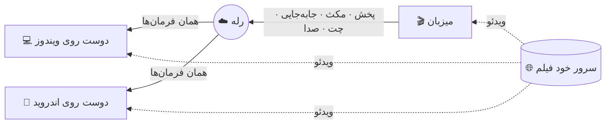

  

### زبان · Read in your language

  
  
  
  

---

## فارسی

**Us Player** به تو و دوستانت اجازه می‌دهد یک فیلم را در یک لحظه با هم ببینید، هر جا که هستید. یک نفر با یک **اسم** اتاق می‌سازد و بقیه با همان اسم وارد می‌شوند — بدون IP، بدون پورت‌فورواردینگ، بدون دست زدن به مودم. یکی مکث بزند، کل اتاق مکث می‌کند. روی فیلم با هم حرف بزنید، یک ❤️ روی صفحه بفرستید، چت را بخوانید بی‌آنکه چشم از فیلم بردارید.

> کامپیوتر و گوشی می‌توانند در یک اتاق باشند: [نسخهٔ اندروید](https://github.com/Pytholearn/UsPlayer-Android) دقیقاً همین پروتکل را حرف می‌زند.

**در این صفحه:** [امکانات](#features) · [نصب](#install) · [تماشای گروهی](#watch-together) · [نحوهٔ کار](#how-it-works) · [حریم خصوصی](#privacy) · [سؤالات](#faq) · [مجوز](#license)

### ✨ امکانات

<table dir="rtl">
<tr>
<td width="50%" valign="top">

#### 🎬 تماشای گروهی
- ساختن و پیوستن **با اسم اتاق** — یک کلیک، بدون تنظیمات
- **کنترل مشترک**: پخش، مکث، جلو و عقب یا تغییر سرعت هر کسی به همه می‌رسد
- اختلاف **حدود ±۱۰۰ میلی‌ثانیه** — همگام‌سازی ساعت، تنظیم نرم سرعت، و پرش فقط وقتی لازم است
- **رمز** اختیاری برای اتاق که هیچ‌وقت روی شبکه نمی‌رود
- ابزار میزبان: بیرون کردن، بستن چت یک نفر
- زیرنویسی که میزبان باز می‌کند **برای همه ارسال می‌شود**، حتی کسی که دیر می‌رسد

</td>
<td width="50%" valign="top">

#### 🎙️ با هم
- **چت صوتی** — دکمهٔ نگه‌داشتنی یا میکروفون باز با فیلتر نویز، بی‌صدا کردن هر نفر
- **چت روی تصویر**: هر پیام کم‌رنگ پایین فیلم می‌آید
- **واکنش‌های شناور** 👍 ❤️ 😂 😮 🔥 👏
- چه کسی حاضر است، پینگ و کیفیت اتصالش، چه کسی حرف می‌زند
- نشانگر «در حال نوشتن» و شمارندهٔ پیام‌های خوانده‌نشده

</td>
</tr>
<tr>
<td valign="top">

#### 🔗 لینک هوشمند
- **لینک صفحهٔ فیلم** را بچسبان، نه فقط لینک مستقیم — Us Player خودش فایل واقعی `.mp4` / `.mkv` / `.m3u8` را پیدا می‌کند و تک‌تک مراحل را نشان می‌دهد
- بهترین کیفیت فیلم اصلی را انتخاب می‌کند و از تریلر و فیلم‌های کناری می‌گذرد
- تب جستجو سایت‌هایی برای پیدا کردن فیلم را فهرست کرده
- لینک‌های خراب با پارامترهای تکراری خودکار تعمیر می‌شوند

</td>
<td valign="top">

#### 🎛️ پخش‌کننده
- سرعت ۰٫۲۵ تا ۴ برابر، فریم‌به‌فریم، فصل‌ها، اسکرین‌شات
- **پخش‌کنندهٔ کوچک** (همیشه رو)، تمام‌صفحه با کنترل‌های خودپنهان‌شو
- ادامه از همان‌جا، تاریخچه، علاقه‌مندی‌ها
- اتصال دوباره هنگام قطعی، عیب‌یابی شبکه
- زیرنویس: تأخیر، اندازه، رنگ، حاشیه، فونت، و **انتخاب انکودینگ** برای `.srt` فارسی

</td>
</tr>
<tr>
<td valign="top">

#### 🔊 صدا و تصویر
- بلندی صدا تا **۳۰۰٪** با کمپرسور اختیاری
- **اکولایزر ۱۰ باند** با پیش‌تنظیم‌ها، یکنواخت‌سازی صدا
- روشنایی، کنتراست، اشباع، گاما، رنگ — زنده
- نسبت تصویر، برش، بزرگ‌نمایی، چرخش، آینه، شارپ، دی‌اینترلیس

</td>
<td valign="top">

#### 💙 برای آدم‌ها ساخته شده
- **فارسی و انگلیسی** در رابط کاربری، با راست‌به‌چپ درست
- سه تم — **Us Blue**، بنفش تیره، نعنایی تیره
- معرفی قدم‌به‌قدم در اولین اجرا، به هر دو زبان
- **خودش را آپدیت می‌کند** و قبلش SHA-256 هر دانلود را بررسی می‌کند
- قابل‌حمل: تنظیمات و تاریخچه کنار خود برنامه. **بدون هیچ ردیابی.**

</td>
</tr>
</table>

### 📥 نصب

1. فایل **`UsPlayer-Setup-<نسخه>.exe`** را از [آخرین ریلیز](https://github.com/Pytholearn/UsPlayer/releases/latest) دانلود کن.
2. اجرایش کن. برنامه نصب می‌شود، میانبر می‌سازد و حذف‌کننده هم اضافه می‌کند.
3. ممکن است ویندوز بگوید **«Windows protected your PC — unknown publisher»**. برای برنامه‌ای که هنوز امضای دیجیتال ندارد طبیعی است: **More info ← Run anyway** را بزن. SHA-256 هر فایل در صفحهٔ ریلیز آمده.

نصب نمی‌خواهی؟ **`UsPlayer-win64.zip`** را بگیر، هر جا خواستی باز کن و `UsPlayer.exe` را اجرا کن.

### 🍿 تماشای گروهی در سه قدم

| | میزبان | دوستان |
|:-:|---|---|
| **۱** | **Party ← Host**، یک اسم اتاق (و اگر خواستی رمز) | **Party ← Join**، همان اسم |
| **۲** | **Create Room** را بزن | **Join** را بزن |
| **۳** | یک فیلم را با لینک باز کن | برای آن‌ها هم باز می‌شود، هماهنگ |

### 🧠 چطور کار می‌کند

فیلم **هیچ‌وقت از سرور ما رد نمی‌شود**. هر کس فیلم را مستقیم از جای خودش پخش می‌کند؛ فقط پیام‌های کوچک کنترلی — پخش، مکث، جابه‌جایی، چت — و صدای گفتگو از رله می‌گذرند.

### 🔒 حریم خصوصی و امنیت

- **رمز اتاق هیچ‌وقت از کامپیوترت بیرون نمی‌رود.** ورود با چالش و پاسخ نمک‌دار است؛ فقط یک اثبات روی شبکه می‌رود.
- **هر چه از اتاق برسد نامطمئن فرض می‌شود.** اندازهٔ هر پیام محدود و بررسی می‌شود، پیام‌های تکراری رد می‌شوند و سیل پیام مهار می‌شود.
- **فایل روی کامپیوترت هیچ‌وقت پخش نمی‌شود.** یک مسیر روی کامپیوتر کس دیگری معنایی ندارد — یا بدتر، به فیلم دیگری اشاره می‌کند — پس اتاق مکث می‌کند و لینک می‌خواهد.
- **آپدیت‌ها بررسی می‌شوند.** دانلودی که با SHA-256 منتشرشده‌اش نخواند دور ریخته می‌شود.
- **بدون ردیابی.** هیچ چیزی دربارهٔ آنچه می‌بینی جایی فرستاده نمی‌شود.

### ❓ سؤال‌های رایج

<b>دوستانم باید در یک شبکه باشند یا پورت باز کنند؟</b>

 
نه. اتاق‌ها با اسم روی رله گرفته می‌شوند، پس دوستانت از هر جا فقط با همان اسم وارد می‌شوند.

<b>کسی با گوشی می‌تواند وارد اتاقم شود؟</b>

 
بله. <a href="https://github.com/Pytholearn/UsPlayer-Android">Us Player اندروید</a> همین اتاق‌ها را می‌سازد و به آن‌ها وارد می‌شود، با چت، واکنش و صدا.

<b>زیرنویس فارسی‌ام <code>???</code> یا حروف به‌هم‌ریخته نشان می‌دهد.</b>

 
تنظیمات زیرنویس را باز کن و <b>انکودینگ</b> را روی <b>Windows-1256</b> بگذار. بیشتر فایل‌های <code>.srt</code> فارسی این‌طور ذخیره شده‌اند.

<b>می‌توانم فیلمی که روی کامپیوترم است را به اشتراک بگذارم؟</b>

 
نه با مسیر فایل — روی کامپیوتر دوستت معنایی ندارد. لینکی بگذار که همه بتوانند باز کنند؛ اگر امتحان کنی، اتاق مکث می‌کند و همین را می‌گوید.

<b>یک سایت می‌گوید فیلم قابل پخش نیست.</b>

 
سرویس‌های اشتراکی با DRM (فیلیمو، نماوا، گپ‌فیلم) بیرون از اپ خودشان پخش نمی‌شوند و Us Player این را صریح می‌گوید، نه اینکه بی‌صدا شکست بخورد. برای سایت‌های ایرانی خاموش کردن VPN معمولاً کمک می‌کند — سرورهایشان اتصال خارجی را می‌بندند.

### 📄 مجوز

این پروژه تحت **[مجوز MIT](../LICENSE)** منتشر شده است. © ۲۰۲۶ Pytholearn — استفاده، تغییر و توزیع آزاد است؛ متن کامل مجوز و ذکر حق نشر در کپی‌ها الزامی است.

---

[English](../README.md) · [中文](README.zh-CN.md) · [فارسی](README.fa.md) · [Русский](README.ru.md) · [MIT License](../LICENSE)

 

اگر Us Player یک شب فیلم را بهتر کرد، یک ⭐ کمک می‌کند بقیه هم پیدایش کنند.

