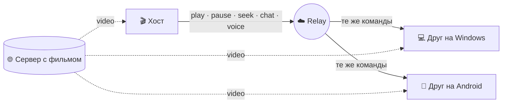

  

### Язык · Read in your language

  
  
  
  

---

## Русский

**Us Player** позволяет вам и друзьям смотреть один и тот же фильм **в один момент**, где бы вы ни были. Один человек создаёт комнату **по имени**, остальные входят по этому имени — без IP, проброса портов и настроек роутера. Пауза у одного — пауза у всех. Общайтесь голосом, отправляйте ❤️ на экран, читайте чат поверх видео.

> ПК и телефон могут быть в одной комнате: [версия для Android](https://github.com/Pytholearn/UsPlayer-Android) использует тот же протокол.

**На странице:** [Возможности](#features) · [Установка](#install) · [Смотреть вместе](#watch-together) · [Как это работает](#how-it-works) · [Конфиденциальность](#privacy) · [Вопросы](#faq) · [Лицензия](#license)

### ✨ Возможности

<table>
<tr>
<td width="50%" valign="top">

#### 🎬 Совместный просмотр
- Создание и вход **по имени комнаты** — один клик, без настройки
- **Общее управление**: play, pause, перемотка и скорость у любого синхронизируются со всеми
- Расхождение **около ±100 ms** — синхронизация часов, мягкая подстройка скорости, seek только при необходимости
- Необязательный **пароль** комнаты, который не передаётся открытым текстом
- Инструменты хоста: исключить, заглушить чат участника
- Субтитры, которые открыл хост, **идут в комнату** — и для опоздавших

</td>
<td width="50%" valign="top">

#### 🎙️ Вместе
- **Голосовой чат** — push-to-talk или открытый микрофон с шумовым гейтом, mute по человеку
- **Чат поверх кадра**: строки плавно появляются внизу видео
- **Реакции** 👍 ❤️ 😂 😮 🔥 👏
- Кто в комнате, ping, качество связи, кто говорит
- Индикатор набора и счётчик непрочитанного

</td>
</tr>
<tr>
<td valign="top">

#### 🔗 Умные ссылки
- Вставьте **страницу фильма**, а не только прямую ссылку — Us Player найдёт `.mp4` / `.mkv` / `.m3u8` и покажет шаги
- Выбор лучшего качества основного фильма, без трейлеров и лишнего
- Вкладка поиска со списком сайтов
- Автоисправление битых ссылок с дублированными параметрами

</td>
<td valign="top">

#### 🎛️ Плеер
- Скорость 0.25–4×, покадрово, главы, скриншоты
- **Мини-плеер** (поверх окон), полноэкранный режим с автоскрытием панели
- Продолжить с места остановки, история, избранное
- Автопереподключение при обрыве, диагностика сети
- Субтитры: задержка, размер, цвет, обводка, шрифт, **кодировка** для персидских `.srt`

</td>
</tr>
<tr>
<td valign="top">

#### 🔊 Аудио и видео
- Громкость до **300%** с опциональным компрессором
- **10-полосный эквалайзер**, пресеты, нормализация
- Яркость, контраст, насыщенность, gamma, оттенок — в реальном времени
- Соотношение сторон, crop, zoom, поворот, зеркало, резкость, deinterlace

</td>
<td valign="top">

#### 💙 Сделано для людей
- Интерфейс приложения: **английский и персидский**, корректный RTL
- Три темы — **Us Blue**, тёмно-фиолетовая, тёмная мятная
- Обучающий тур при первом запуске на обоих языках
- **Автообновление** с проверкой SHA-256 каждой загрузки
- Портативность: настройки рядом с exe. **Без телеметрии.**

</td>
</tr>
</table>

### 📥 Установка

1. Скачайте **`UsPlayer-Setup-<version>.exe`** с [последнего релиза](https://github.com/Pytholearn/UsPlayer/releases/latest).
2. Запустите установщик — появятся ярлыки и деинсталлятор.
3. Windows может показать **«Windows protected your PC — unknown publisher»**. Для приложения без подписи это нормально: **More info → Run anyway**. SHA-256 файлов указаны на странице релиза.

Без установщика? Возьмите **`UsPlayer-win64.zip`**, распакуйте и запустите `UsPlayer.exe`.

### 🍿 Три шага к совместному просмотру

| | Хост | Друзья |
|:-:|---|---|
| **1** | **Party → Host**, имя комнаты (и пароль по желанию) | **Party → Join**, то же имя |
| **2** | **Create Room** | **Join** |
| **3** | Откройте фильм по ссылке | У них откроется синхронно |

### 🧠 Как это работает

Видео **не проходит через наш сервер**. Каждый тянет поток напрямую с источника; через relay идут только команды управления, чат и голос.

### 🔒 Конфиденциальность и безопасность

- **Пароль комнаты не покидает ваш ПК.** Вход по salted challenge-response; по сети уходит только proof.
- **Всё из комнаты считается недоверенным.** Лимиты размера, валидация, защита от replay и flood.
- **Локальный путь к файлу не рассылается.** На чужом ПК он бессмысленен или указывает на другой файл — комната ставится на паузу и просит ссылку.
- **Обновления проверяются.** Загрузка с неверным SHA-256 отбрасывается.
- **Без телеметрии.** Мы не отправляем данные о том, что вы смотрите.

### ❓ Частые вопросы

<b>Нужна ли одна сеть или открытый порт?</b>

 
Нет. Комнаты регистрируются по имени на relay — друзья подключаются откуда угодно, зная только имя.

<b>Можно ли зайти с телефона?</b>

 
Да. <a href="https://github.com/Pytholearn/UsPlayer-Android">Us Player для Android</a> создаёт и входит в те же комнаты, с чатом, реакциями и голосом.

<b>Персидские субтитры показывают <code>???</code> или кракозябры?</b>

 
В настройках субтитров выберите кодировку <b>Windows-1256</b> — так сохранено большинство персидских <code>.srt</code>.

<b>Можно ли «расшарить» файл с моего ПК?</b>

 
Не через путь к файлу — на машине друга он не сработает. Дайте ссылку, которую откроют все; при попытке с путём комната остановится и подскажет.

<b>Сайт пишет, что фильм нельзя воспроизвести?</b>

 
Сервисы с DRM (Filimo, Namava, Gapfilm) не играют вне своих приложений — Us Player сообщает об этом явно. Для некоторых иранских сайтов помогает выключить VPN — блокируют зарубежные IP.

### 📄 Лицензия

Проект распространяется под **[MIT License](../LICENSE)**. © 2026 Pytholearn — свободное использование и изменение при сохранении текста лицензии и уведомления об авторских правах.

---

[English](../README.md) · [中文](README.zh-CN.md) · [فارسی](README.fa.md) · [Русский](README.ru.md) · [MIT License](../LICENSE)

 

Если Us Player сделал вечер кино лучше — поставьте ⭐, так его найдут другие.

