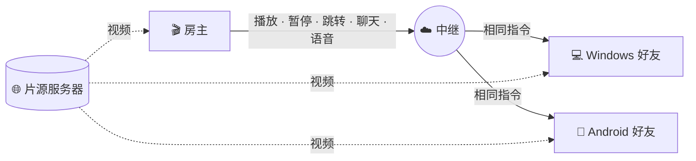

  

### 选择语言 · Read in your language

  
  
  
  

---

## 中文

**Us Player** 让你和朋友在任何地方**同一时刻**看同一部影片。一人用**房间名**创建房间，其他人用相同名字加入 — 无需 IP、端口转发或路由器设置。一人暂停，整个房间一起暂停。边看边聊，发送 ❤️ 反应，聊天字幕叠在画面底部，不用移开视线。

> 电脑和手机可以共用一个房间：[Android 版](https://github.com/Pytholearn/UsPlayer-Android) 使用完全相同的协议。

**本页导航：** [功能](#features) · [安装](#install) · [一起看](#watch-together) · [原理](#how-it-works) · [隐私](#privacy) · [常见问题](#faq) · [许可证](#license)

### ✨ 功能

<table>
<tr>
<td width="50%" valign="top">

#### 🎬 同步观影
- 用**房间名**创建或加入 — 一键完成，无需配置
- **共享控制**：任何人的播放、暂停、跳转或倍速都会同步给所有人
- 误差约 **±100 ms** — 时钟同步、温和调速、仅在必要时跳转
- 可选房间**密码**，且密码不会明文传输
- 房主工具：踢人、禁言某人的聊天
- 房主加载的**字幕会同步到房间**，晚加入的人也能收到

</td>
<td width="50%" valign="top">

#### 🎙️ 一起互动
- **语音聊天** — 按键说话或常开麦克风（带噪声门），可单独静音
- **画面上的聊天**：每条消息在视频底部淡入淡出
- **浮动表情** 👍 ❤️ 😂 😮 🔥 👏
- 在线成员、延迟、连接质量、正在说话的人
- 正在输入提示与未读计数

</td>
</tr>
<tr>
<td valign="top">

#### 🔗 智能链接
- 粘贴**影片页面**，而不只是直链 — Us Player 会解析背后的 `.mp4` / `.mkv` / `.m3u8` 并显示每一步
- 自动选择正片最佳画质，跳过预告和侧边内容
- 「搜索」标签列出可找片的网站
- 自动修复重复查询参数导致的坏链接

</td>
<td valign="top">

#### 🎛️ 播放器
- 0.25–4× 倍速、逐帧、章节、截图
- **迷你播放器**（置顶）、全屏与自动隐藏控件
- 断点续播、历史记录、收藏
- 流中断时自动重连、网络诊断
- 字幕：延迟、大小、颜色、描边、字体，波斯语 `.srt` 可选**编码**

</td>
</tr>
<tr>
<td valign="top">

#### 🔊 音视频
- 音量最高 **300%**，可选压缩器
- **10 段均衡器**与预设、响度归一
- 亮度、对比度、饱和度、伽马、色相 — 实时调节
- 宽高比、裁剪、缩放、旋转、镜像、锐化、去隔行

</td>
<td valign="top">

#### 💙 为人而做
- 应用界面支持**英语与波斯语**，RTL 布局正确
- 三种主题 — **Us Blue**、深紫、深薄荷
- 首次启动有引导教程（英/波斯语）
- **自动更新**，且先校验下载文件的 SHA-256
- 便携：设置与历史与程序同目录。**无遥测。**

</td>
</tr>
</table>

### 📥 安装

1. 从 [最新发布页](https://github.com/Pytholearn/UsPlayer/releases/latest) 下载 **`UsPlayer-Setup-<version>.exe`**。
2. 运行安装程序，会创建快捷方式和卸载项。
3. Windows 可能提示 **「Windows 已保护你的电脑 — 未知发布者」**。尚未代码签名的应用常见此提示：点 **更多信息 → 仍要运行**。每个文件的 SHA-256 见发布页。

不想安装？下载 **`UsPlayer-win64.zip`**，解压到任意位置，运行 `UsPlayer.exe`。

### 🍿 三步开始一起看

| | 房主 | 好友 |
|:-:|---|---|
| **1** | **Party → Host**，输入房间名（可选密码） | **Party → Join**，输入相同名字 |
| **2** | 点 **Create Room** | 点 **Join** |
| **3** | 用链接打开影片 | 好友端同步打开并播放 |

### 🧠 工作原理

影片**不会经过我们的服务器**。每人直接从片源拉流；只有播放控制、聊天、语音等小数据经中继转发。

### 🔒 隐私与安全

- **房间密码不会离开你的电脑。** 加入时使用加盐挑战应答，网络上只传证明。
- **来自房间的数据一律按不可信处理。** 消息有大小限制与校验，防重放，限速防洪水。
- **不会广播你电脑上的本地路径。** 路径在他人电脑上无意义或指向别的文件，因此房间会暂停并要求使用链接。
- **更新经校验。** 与发布页 SHA-256 不符的下载会被丢弃。
- **无遥测。** 不会上传你观看了什么。

### ❓ 常见问题

<b>好友要在同一局域网或开端口吗？</b>

 
不需要。房间在中继上按名称注册，好友在任何地方用房间名即可加入。

<b>手机能加入我的房间吗？</b>

 
可以。<a href="https://github.com/Pytholearn/UsPlayer-Android">Us Player Android 版</a> 可加入或创建相同房间，支持聊天、表情与语音。

<b>波斯语字幕显示 <code>???</code> 或乱码？</b>

 
打开字幕设置，将<b>编码</b>设为 <b>Windows-1256</b>。多数波斯语 <code>.srt</code> 使用该编码。

<b>能分享我电脑里的本地文件吗？</b>

 
不能通过文件路径 — 在好友电脑上无效。请分享大家都能打开的链接；若尝试本地路径，房间会暂停并提示。

<b>网站提示无法播放？</b>

 
带 DRM 的订阅平台（如 Filimo、Namava、Gapfilm）无法在官方应用外播放，Us Player 会明确提示。部分伊朗站点需关闭 VPN — 服务器可能屏蔽海外 IP。

### 📄 许可证

本项目采用 **[MIT 许可证](../LICENSE)**。© 2026 Pytholearn — 可自由使用与修改，分发时需保留版权声明与许可全文。

---

[English](../README.md) · [中文](README.zh-CN.md) · [فارسی](README.fa.md) · [Русский](README.ru.md) · [MIT License](../LICENSE)

